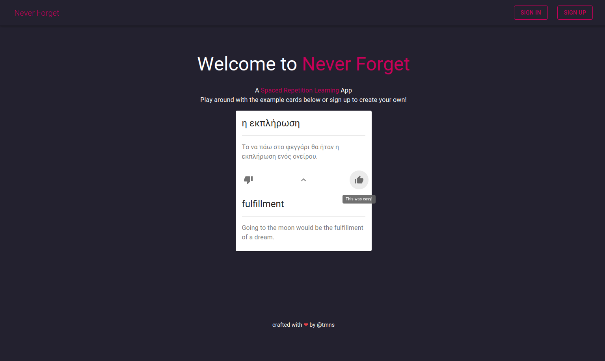

# Never Forget



Never Forget is a spaced repetition learning app designed to be as simple as possible to use! It features a card based learning interface, as this is a rather familiar method of learning for folks. Before building the app, I also built a [CLI version](https://github.com/tmns/never-forget-cli) and a [backend server](https://github.com/tmns/never-forget-server); so feel free to play around with both of those as well.

The application has been built with the help of React, Material, Formik, Apollo, MongoDB (via Mongoose), and Node with Express. You can give it a spin [here](https://never-forget-app.herokuapp.com). Note however, I use a free tier at Heroku so the initial start up time is pretty slow!

So far, most of the main functionality has been implemented. You can:

* Create an account (ie, a user)
* Change your username
* Change your password
* Delete your account
* Create a deck
* Create a card
* Browse decks
* Browse cards
* Edit a deck
* Edit a card
* Delete a deck
* Delete a card
* Study cards
* Export cards (csv)

The following functionality remains to be implemented:

* Import cards (this is not yet supported by Material)

## Build
To build, `cd` to project root and run:
```
$ npm install && npm run build
```
This should install dependencies and then output a transpiled version of app.js to `dist`.

## Run
To run the app in development, it is suggested you use the following command from the project root:
```
$ npm run dev
```
This will utilize `concurrently` to run both the server and client simultaneously. If instead you wish to run them independently, see the project's `package.json` for the relavent script commands.

## Usage
First, before running you will want to set up a Mongo database, which can be local or remote. Once this is done you can plug it's URI into the `DB_URI` variable of `server/config/config.js`.

After that, you should be able to run the app and create a user account. From there, you can add decks, cards, study them, etc.

## License
The source of this app may be used under the WTFPL - or, if you take issue with that, consider it to be under the CC0.

## Contributing
Feedback and contributions are welcome. Feel free to create issues, fork, submit pull requests, etc. However, if you make any changes to the application logic, make sure to run the full test suite before opening a PR. 

To run tests, simply execute the following in the project root:
```
$ npm test
```

**PR's that do *not* include output from the above command will be rejected automatically!**

Finally, if you want to contribute in a different way, you can always buy me a coffee ^_^

[](https://www.buymeacoffee.com/tmns)

